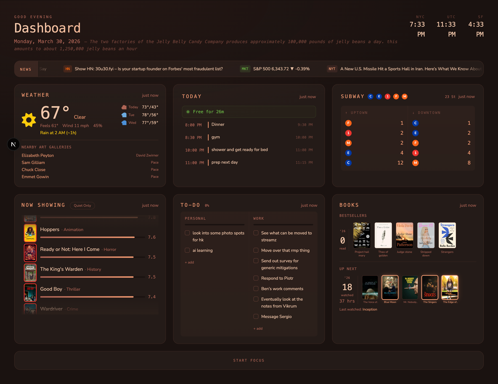

# Dashboard

An ambient, always-on personal dashboard built as a Next.js route. Designed for a wall-mounted Raspberry Pi display but works in any browser.



## Widgets

**Weather** — Current conditions, 3-day forecast, feels-like, wind, humidity, and precipitation alerts. Uses live GPS coordinates when available. Nearby art gallery exhibits listed below.

**Today** — Google Calendar events with time blocks, free-gap detection between events, and a "Free for Xh Ym" indicator when no event is active. Flight events are auto-detected and surfaced as a reminder above the clock.

**Transit** — Real-time MTA arrivals for configurable lines and station. Uptown/Downtown split with alert banners. Nearby NYC events listed below.

**Now Showing** — Movies currently in theaters via TMDB, sorted by audience heat. Auto-scrolling credits-style list with poster art, genre tags, and ratings. "Quiet Only" filter removes Action/Horror/Thriller.

**To-Do** — Personal and work task lists pulled from Notion. Inline add (`+ add`), tap-to-complete with optimistic updates, per-column progress bars, daily streak tracking, and confetti on 100% completion. URLs in todo text are rendered as clickable links.

**Books & Watchlist** — NYT Bestsellers with cover art, yearly read count from Goodreads, and last-read title. Letterboxd watchlist posters with streaming availability highlights, yearly film count, and total hours watched. Hover any cover to see the title.

**News Ticker** — Scrolling headlines from Hacker News, market data, and NYT. Links open in browser; on Raspberry Pi, tapping sends the link to a Discord channel instead.

**Pomodoro** — 25m work / 5m break / 15m long break cycling. Circular SVG progress ring, session counter, and a red screen flash on phase transitions.

---

## Setup

### 1. Prerequisites

- Node.js 18+
- A Google Cloud project with the Calendar API enabled
- A Notion integration with access to your todo pages
- API keys for the external services listed below

### 2. Clone

This dashboard is a submodule inside the [chintu](https://github.com/Shubham-Gupte/chintu) monorepo. To use it standalone:

```sh
git clone https://github.com/Shubham-Gupte/dashboard.git
cd dashboard
npm install
```

### 3. Configure `lib/config.json`

Edit `lib/config.json` with your personal settings:

```json
{
  "address": "241 W 24th St, New York, NY 10011",
  "lat": 40.7459,
  "lon": -74.0004,
  "subwayLines": ["C", "E", "1", "F", "M"],
  "subwayStation": "23 St",
  "letterboxd": "your-letterboxd-username",
  "goodreads": "your-goodreads-user-id",
  "timezones": [
    { "label": "NYC", "tz": "America/New_York" },
    { "label": "UTC", "tz": "UTC" },
    { "label": "SF", "tz": "America/Los_Angeles" }
  ],
  "streamingProviders": {
    "netflix": true,
    "prime": true,
    "max": true,
    "hulu": true,
    "disney": true,
    "crunchyroll": true
  }
}
```

| Field | Description |
|---|---|
| `address` | Your address — used as fallback for weather if GPS is unavailable |
| `lat` / `lon` | Coordinates for your address — avoids a geocoding call on cold start |
| `subwayLines` | MTA lines to track arrivals for |
| `subwayStation` | Station name shown in the Transit widget |
| `letterboxd` | Your Letterboxd username |
| `goodreads` | Your Goodreads user ID (from your profile URL) |
| `timezones` | Clock entries shown in the header |
| `streamingProviders` | Set `true` to highlight watchlist films available on that service |

### 4. Environment Variables

Create a `.env.local` at the project root:

```sh
# Dashboard auth — passphrase required to access the dashboard
DASHBOARD_SECRET=your-passphrase

# Google Calendar (pick one auth method)
GOOGLE_CALENDAR_ID=primary,other@group.calendar.google.com  # comma-separated
GOOGLE_SERVICE_ACCOUNT_JSON={"type":"service_account",...}  # JSON as a string
# OR
GCS_KEY_FILE=/path/to/service-account-key.json              # path to key file

# Notion (To-Do widget)
NOTION_API_KEY=secret_...
NOTION_TODO_DB=your-notion-page-id   # personal list
NOTION_WORK_DB=your-notion-page-id   # work list (optional)

# TMDB (Now Showing widget)
TMDB_API_KEY=your-tmdb-api-key

# NYT Books (Bestsellers widget)
NYT_BOOKS_API_KEY=your-nyt-api-key

# Gemini (fun fact in header)
FUN_FACT_API_KEY=your-gemini-api-key

# Discord (Raspberry Pi share-to-Discord)
DISCORD_WEBHOOK_URL=https://discord.com/api/webhooks/...

# Optional: directory for runtime caches (defaults to ./lib/dashboard)
# DASHBOARD_ROOT=/path/to/cache/dir
```

#### Google Calendar — Service Account Setup

1. Go to [Google Cloud Console](https://console.cloud.google.com) → create or select a project
2. Enable the **Google Calendar API**
3. Go to **IAM & Admin → Service Accounts** → create a service account
4. Create a JSON key for the service account and download it
5. In Google Calendar, share your calendar(s) with the service account email (`name@project.iam.gserviceaccount.com`) — grant **Viewer** access
6. Either paste the JSON contents into `GOOGLE_SERVICE_ACCOUNT_JSON` (as a single-line string) or set `GCS_KEY_FILE` to the path of the downloaded JSON file

#### Notion — Integration Setup

1. Go to [notion.so/my-integrations](https://www.notion.so/my-integrations) → **New Integration**
2. Copy the **Internal Integration Secret** → set as `NOTION_API_KEY`
3. Open each todo page in Notion → click **···** menu → **Connections** → add your integration
4. Copy the page ID from the URL (`notion.so/Page-Title-{PAGE_ID}`) → set as `NOTION_TODO_DB` / `NOTION_WORK_DB`

### 5. Run

```sh
npm run dev
```

Open [http://localhost:3000/dashboard](http://localhost:3000/dashboard).

To run via Docker inside the chintu monorepo:

```sh
docker compose up frontend
```

Then open [http://localhost:8080/dashboard](http://localhost:8080/dashboard).

---

## Architecture

Single `page.tsx` client component mounted at `/dashboard`. All data is fetched server-side by API routes under `/dashboard/api/*` and polled client-side via SWR.

| Route | Source | Client poll |
|---|---|---|
| `/api/weather` | Open-Meteo (fully dynamic, no cache) | 10 min |
| `/api/calendar` | Google Calendar (service account JWT) | 5 min |
| `/api/transit` | MTA GTFS-RT | 30 sec |
| `/api/movies` | TMDB | 6 hr |
| `/api/letterboxd` | Letterboxd RSS + TMDB | 1 hr |
| `/api/goodreads` | Goodreads RSS | 1 hr |
| `/api/trending-books` | NYT Books API | 24 hr |
| `/api/todo` | Notion Blocks API | 10 min |
| `/api/news` | HN, NYT, market APIs | 15 min |
| `/api/events` | NYC event sources | 1 hr |
| `/api/galleries` | Chelsea gallery listings | 24 hr |
| `/api/fun-fact` | Gemini | 1 hr |
| `/api/share` | Discord Webhook | on-demand |

SWR is configured with `refreshWhenHidden: true` so the display stays live even when backgrounded. When foregrounded after 5+ minutes, all data silently re-fetches without a page reload.

**Raspberry Pi mode** is detected via user-agent (`linux.*arm|aarch64`). In this mode, outbound links are replaced with Discord share buttons rather than opening new tabs.
